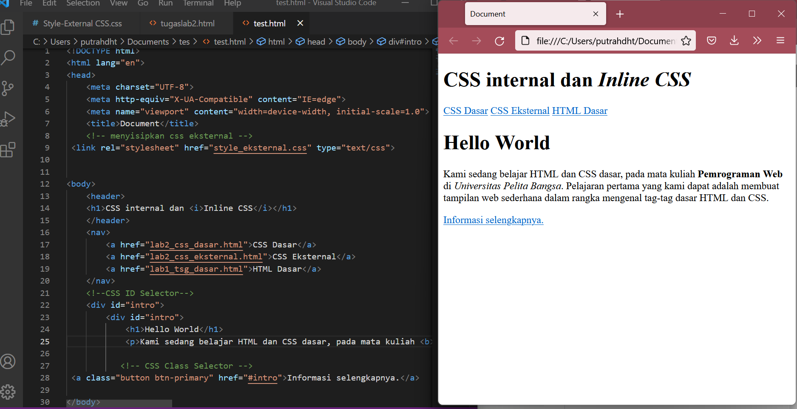
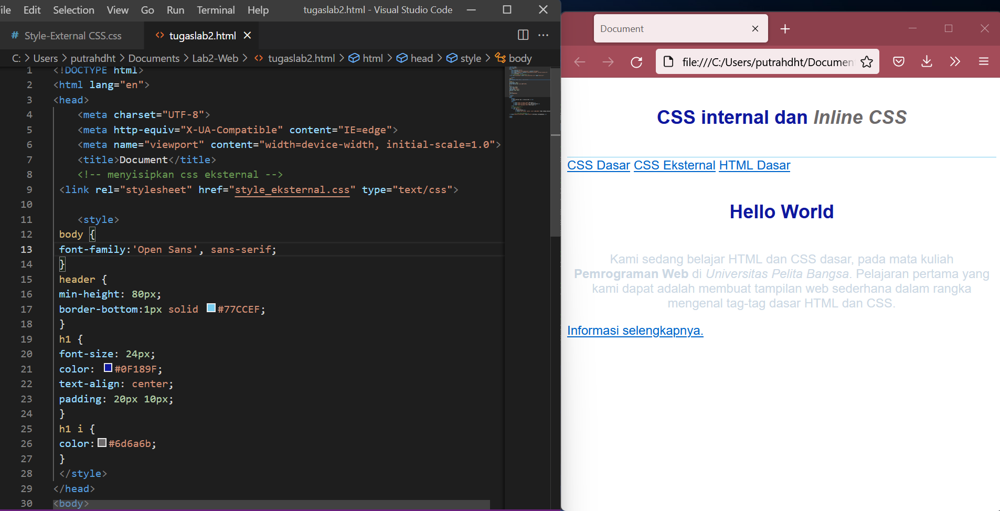
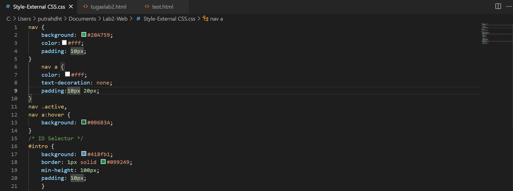
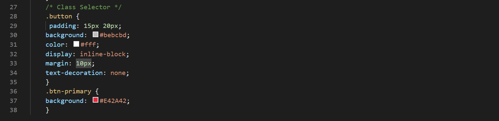
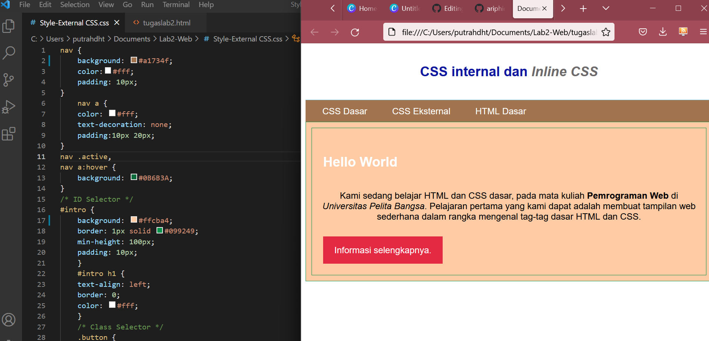
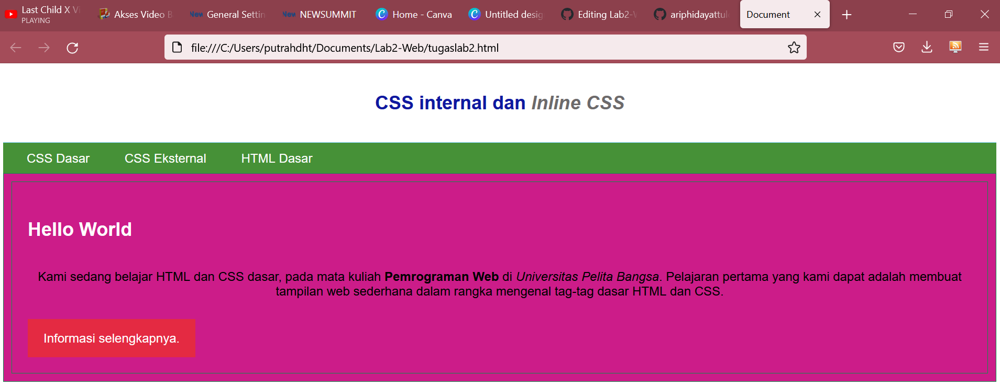
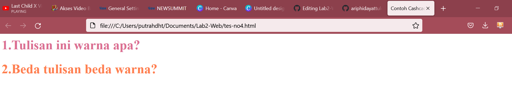
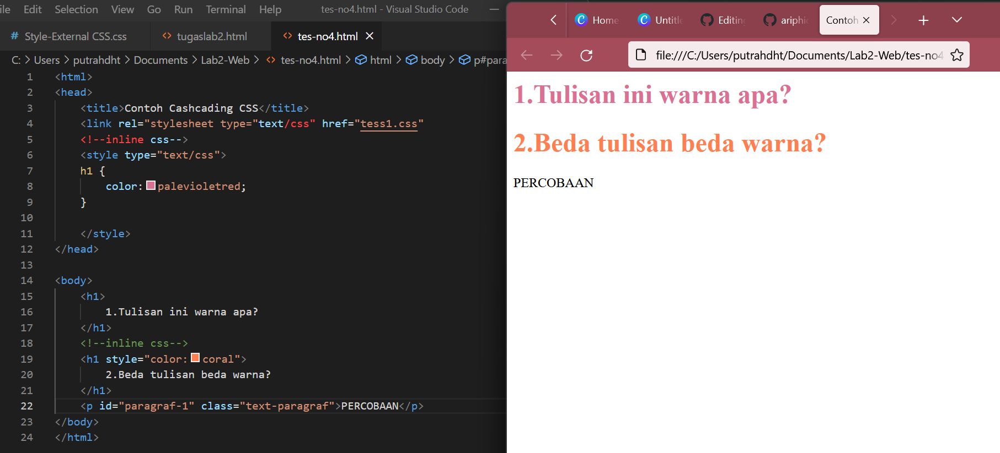

# NAMA : M. AQIL AL FARID
# NIM : 312010140
# KELAS : TI.20.B.1
# *TUGAS* *PEMOGRAMAN-WEB*

Hi guys , kali ini saya akan menulis cara hasil kerja tugas pemograman LAB 2.

## Disini saya akan menggunakan Laptop Kantor

# 1. *MEMBUAT* *DOKUMENT* *HTML*

Berikut saya akan memberikan contoh coding dan hasil HTML nya :

# 2. *MEMBUAT CSS INTERNAL*

Lanjut , kali ini kita akan membuat perbedaan dengan cara meng input CSS INTERNAL kedalam Codingan:

# 3. *MEMBUAT CSS EXTERNAL*

Di pembahasan kali ini Membuat CSS EXTERNAL , perbedaanya yakni disini kita bisa menambah Bachground HTML dengan warna yang kita inginkan 
Berikut saya kasih gambar hasil codingannya :

Setelah itu jangan lupa agar untuk sangkutkan file CSS dgn HTML

## berikut adalah hasil dari codingannya :

Sekian pembelajaran hasil tugas kali ini , sekian Terima kasih.

# PERTANYAAN DAN JAWABAN TUGAS

# 1. Lakukan eksperimen dengan mengubah dan menambah properti dan nilai pada kode CSS dengan mengacu pada CSS Cheat Sheet yang diberikan pada file terpisah dari modul ini.

# 2.  Apa perbedaan pendeklarasian CSS elemen h1 {...} dengan #intro h1 {...}? berikan penjelasannya!

jawaban

perbedaaannya jika hanya h1{} maka akan merubah semua yang ada didalam elemen h1 sedangkan intro h1 hanya akan merubah yang memiliki tag intro

# 3. Apabila ada deklarasi CSS secara internal, lalu ditambahkan CSS eksternal dan inline CSS pada elemen yang sama. Deklarasi manakah yang akan ditampilkan pada browser? Berikan penjelasan dan contohnya!

jawaban

jika ketiga CSS merubah elemen yang sama maka deklarasi tersebut akan mengikuti aturan prioritas dimana prioritas CSS nya seperti ini:

    inline CSS
    ID selector CSS
    internal CSS
    external CSS contoh: ini adalah tampilan coding pada html testing dimana terdapat 2 kalimat yang memiliki elemen yang sama yaitu h1:

disini bisa dilihat sudah terdapat 2 css mencoba merubah warna text h1 :

# 4. Pada sebuah elemen HTML terdapat ID dan Class, apabila masing-masing selector tersebut terdapat deklarasi CSS, maka deklarasi manakah yang akan ditampilkan pada browser? Berikan penjelasan dan contohnya! ( 
 )
  
  
